# ⬇️_성분_별_NIH의

## 기본 정보

- **계정**: @kor.medicalmeme
- **게시일**: 2026-01-19
- **URL**: https://www.instagram.com/p/DTsCUfzkuYb/
- **카드 수**: 12장
- **좋아요**: 427

## 캡션

```
⬇️ 성분 별 NIH의 코멘트 정리본 ⬇️

상식적인 내용이지만, 불면의 가장 큰 적은 불규칙적인 생활습관과 큰 스트레스입니다.

그럼에도 우리는 종종 살아남기 위해 생활습관과 스트레스를 개선할 수 없을 때가 있고, 불면은 너무나도 괴롭습니다. 그럴 때면 지푸라기 잡는 심정으로 각종 영양제와 보충제를 찾게 되는 것이라고 생각합니다.

뇌에 대한 문제인 만큼 기전 연구가 제한적이고, 사람 대상 연구의 규모들도 다소 적어 평가하기가 까다롭지만, 잠은 소중한 것이니 이 자료라도 판단에 참고가 되신다면 큰 보람일 것이라 믿고 제작하였습니다.

아래에 각 성분에 대한 NIH의 발언 정리본을 써두었습니다. 읽어보시고 따분한 내용으로 인해 오늘 하루라도 푹 주무시길 바랍니다. 감사합니다.

멜라토닌 
➡️ 특정 수면 장애(시차증, 수면위상지연증)에는 도움이 될 수 있으나, 만성 불면증에 대해서는 근거가 일관되지 않음 (Melatonin supplements can be helpful for certain sleep disorders, such as jet lag and delayed sleep-wake phase disorder. Evidence for chronic insomnia is mixed)

테아닌
➡️ 이완을 촉진하고 수면의 질을 개선할 가능성은 시사되지만, 근거는 제한적이며 결론적이지 않음
(Some studies suggest that L-theanine may help promote relaxation and improve sleep quality. However, evidence is limited and not conclusive)

캐모마일(아피게닌) 
➡️ 수면 개선 효과를 뒷받침하는 임상적 근거는 제한적임 (Clinical evidence supporting chamomile for sleep is limited.)

GABA 
➡️ 장벽을 통과하는지는 불분명하며, 수면 개선에 대한 근거는 불충분함 (It is unclear whether orally consumed GABA can cross the blood-brain barrier. Evidence for GABA supplements improving sleep is insufficient)

아슈와간다
➡️ 전반적으로 수면에 대한 효과는 작았으며, 소수의 소규모 연구에 기반함 (Overall, the benefits for sleep were small. Results are based on a few small studies)

식물성 멜라토닌 (타트체리) 
➡️ 소규모 연구에서 수면 시간이 증가할 가능성이 시사되었으나, 근거는 예비적 수준임
(Some small studies suggest that tart cherry juice may improve sleep duration, but the evidence is preliminary)
```

## 카드별 이미지

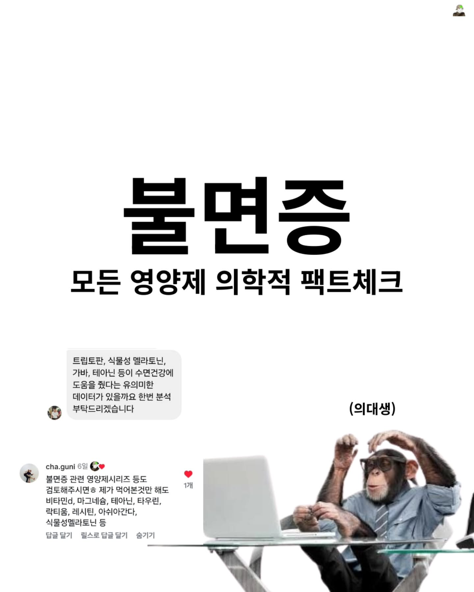

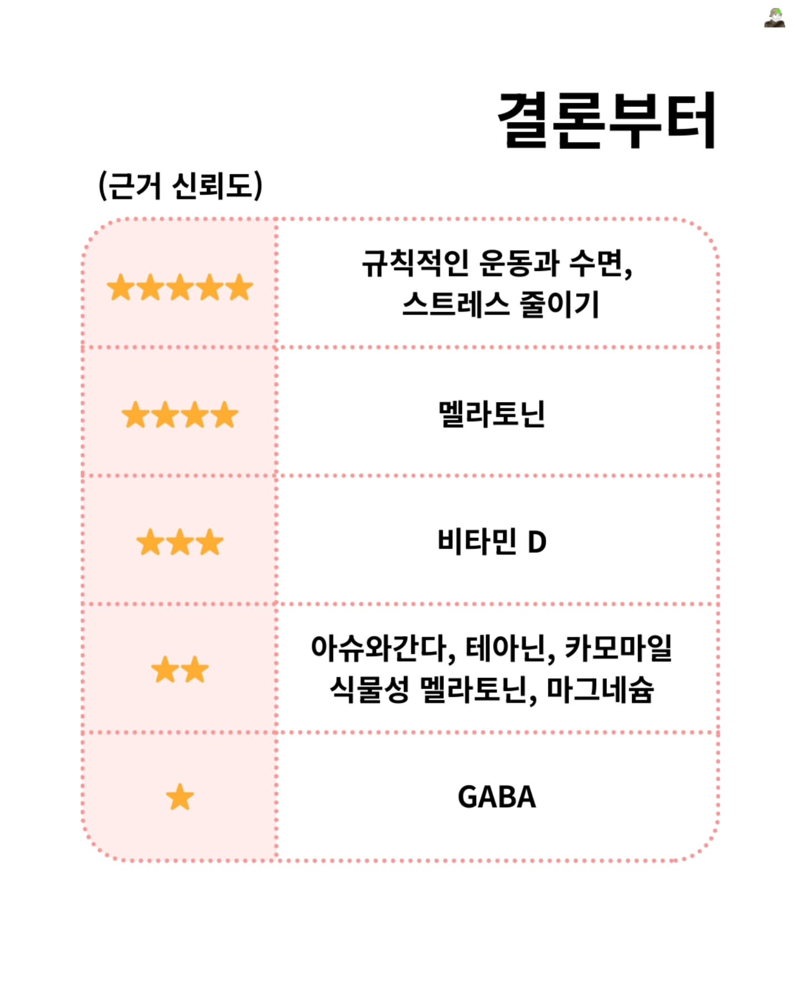

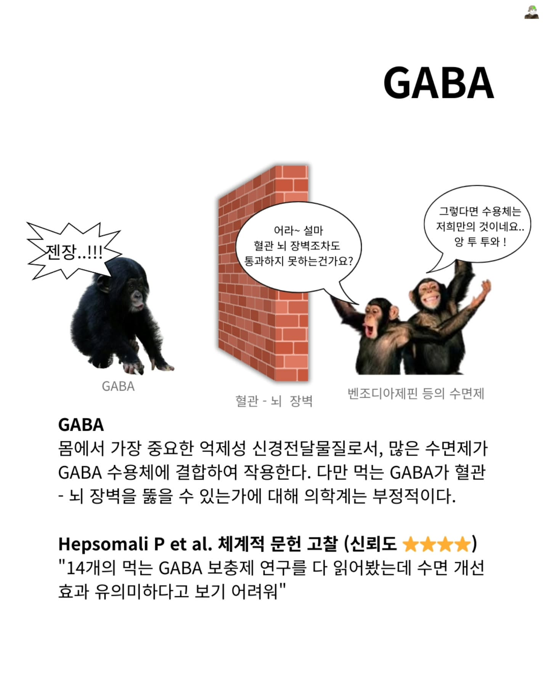

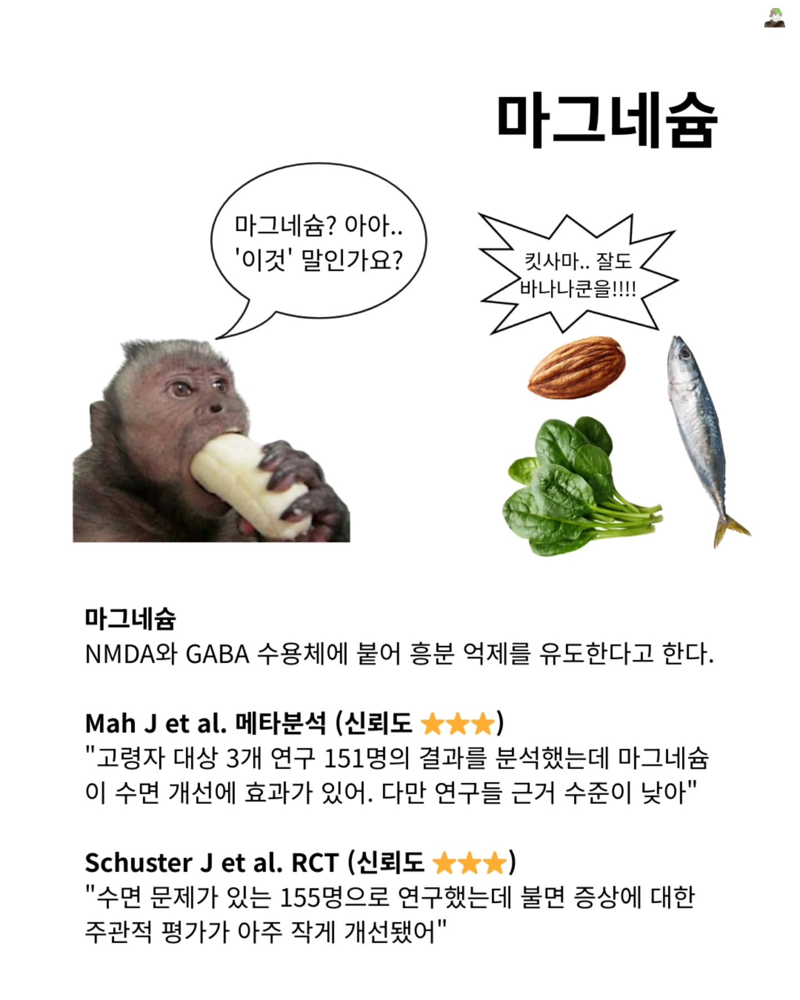

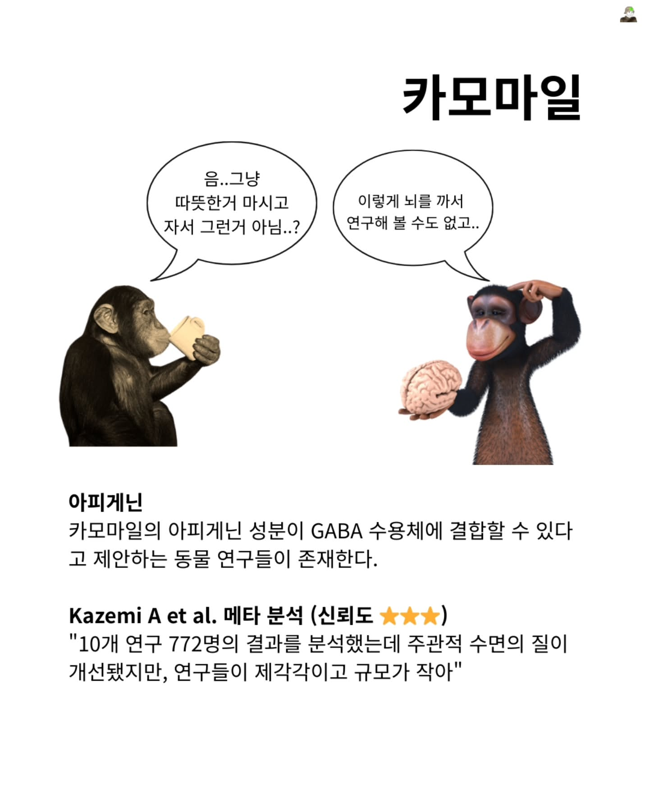

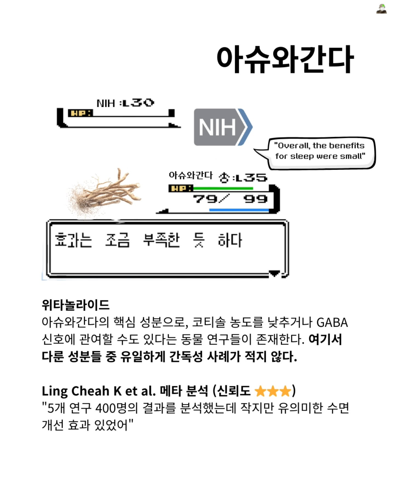

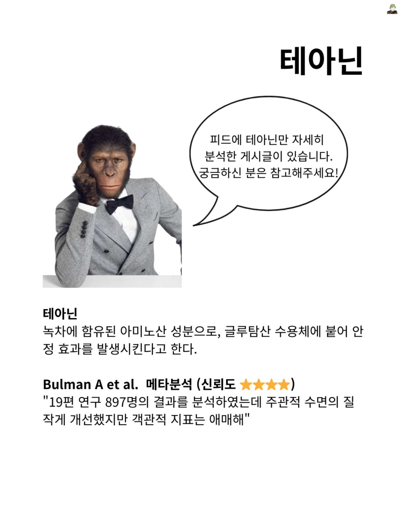

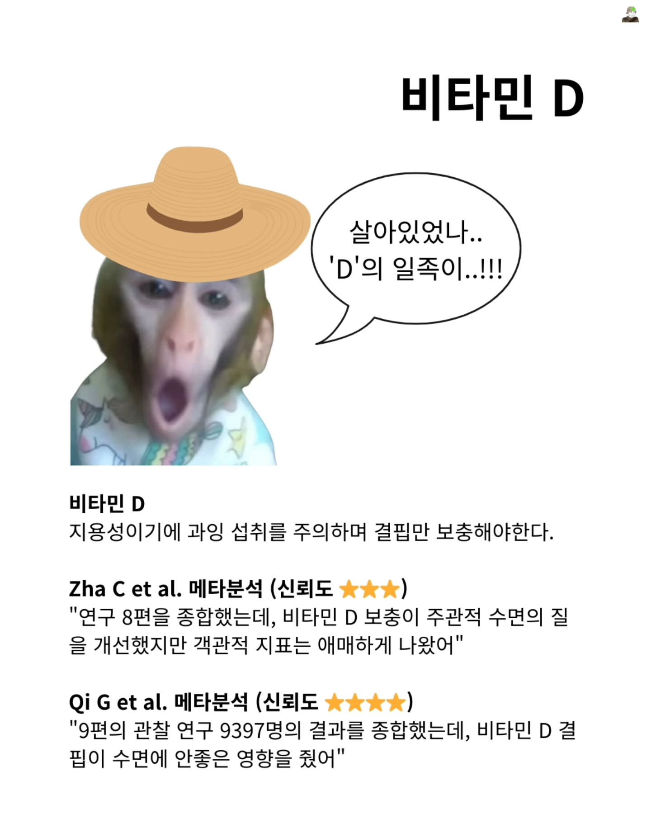

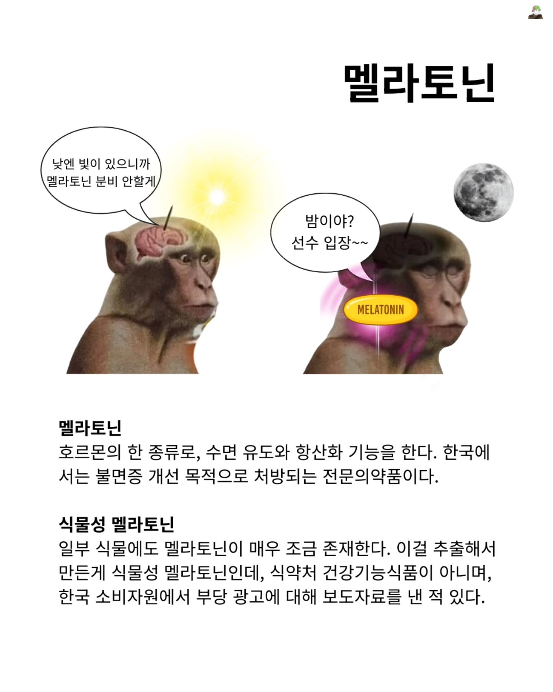

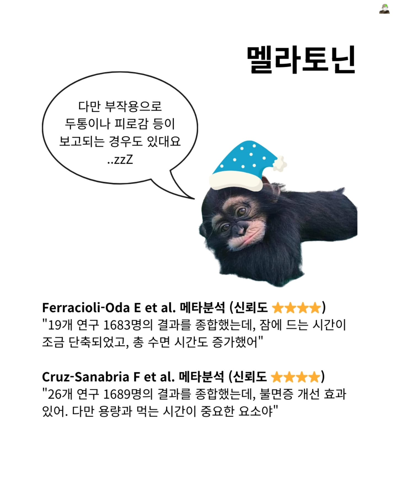

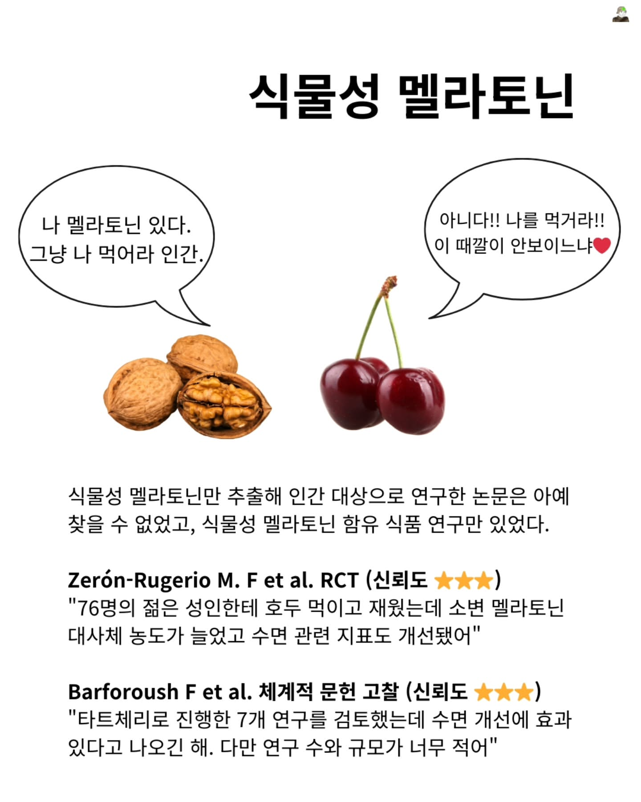

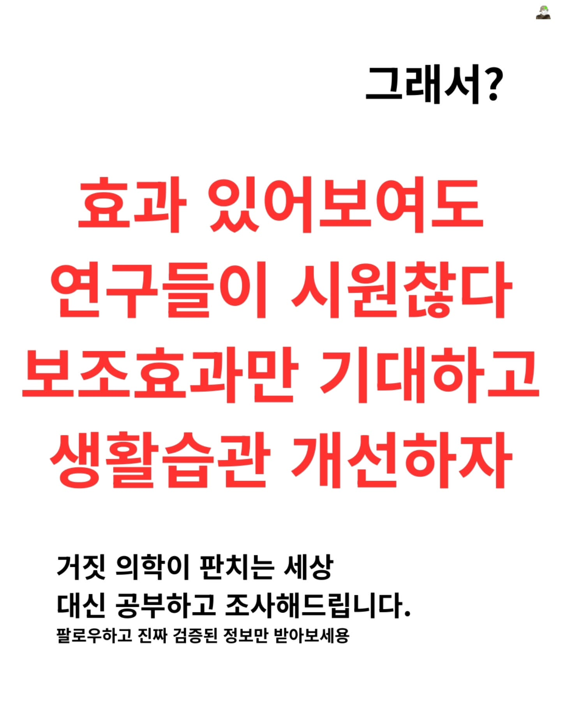

