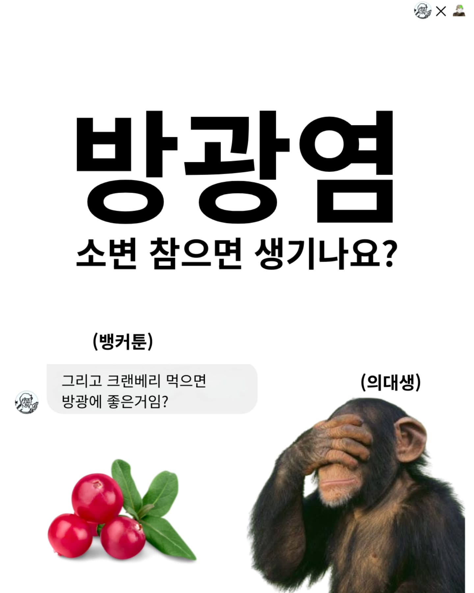
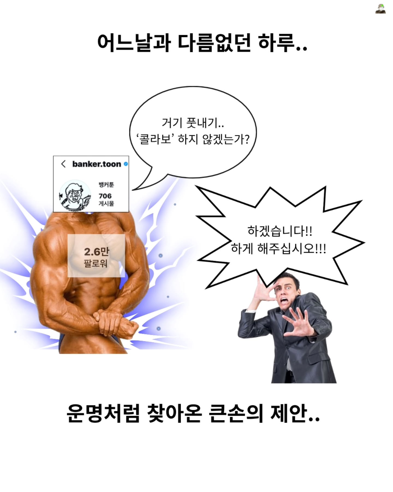
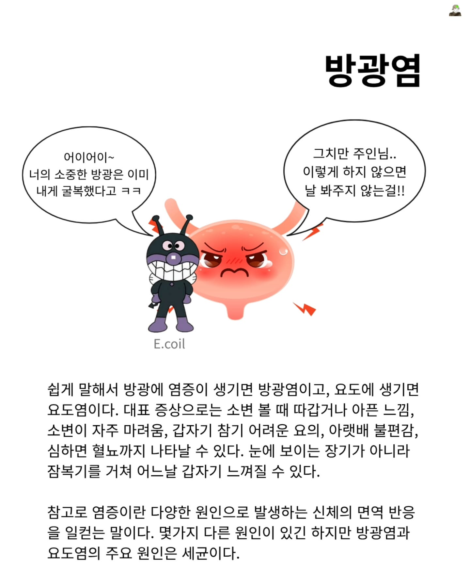
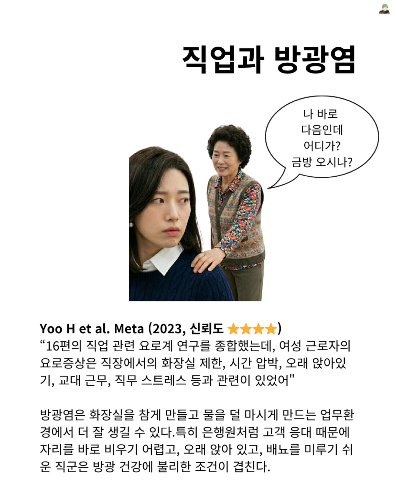
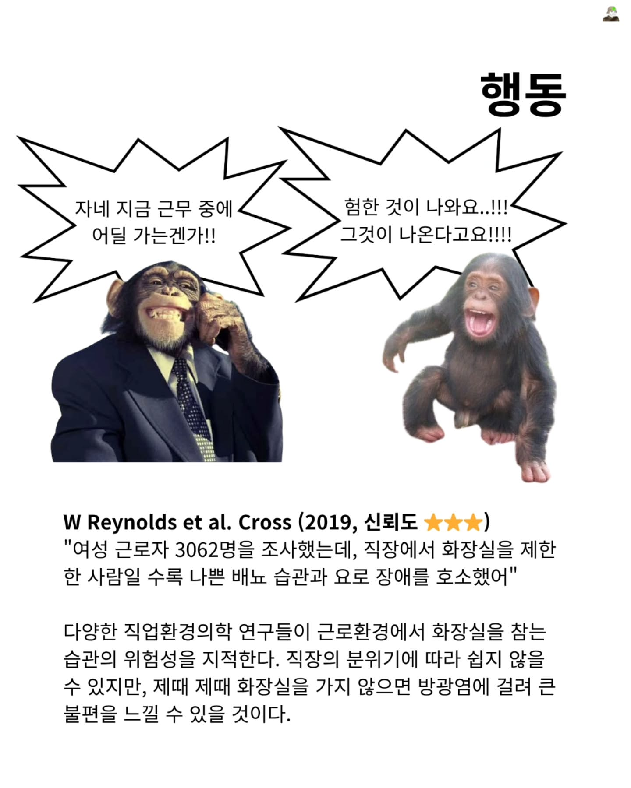
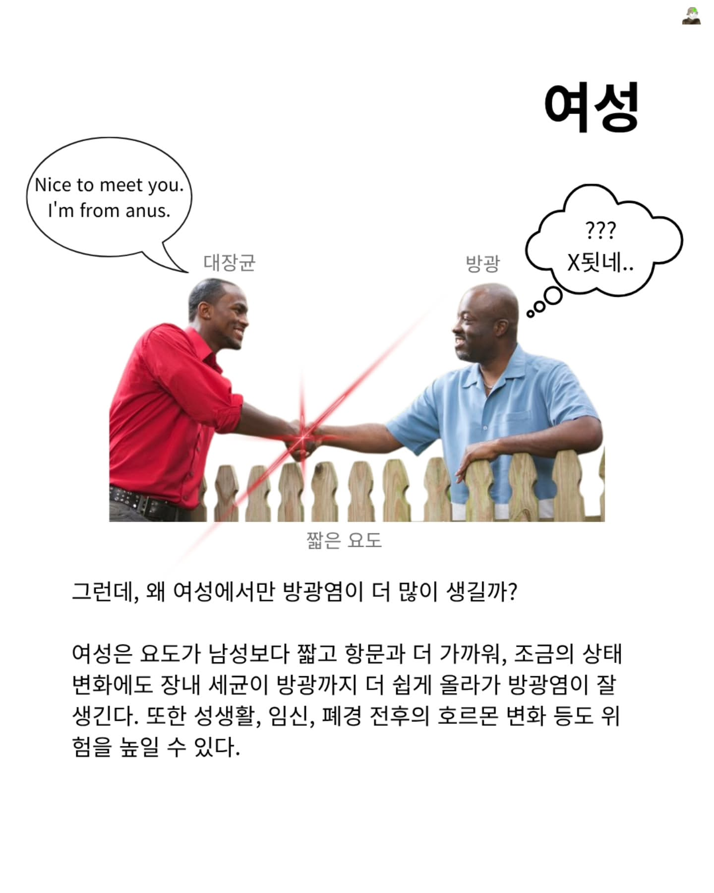
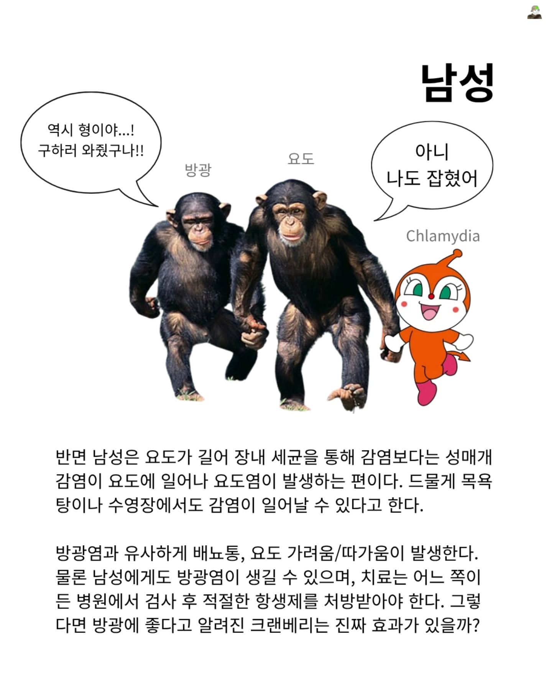
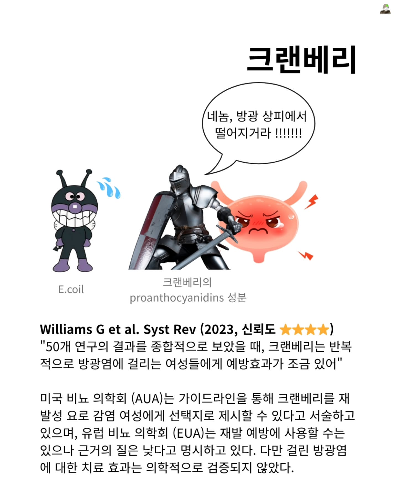
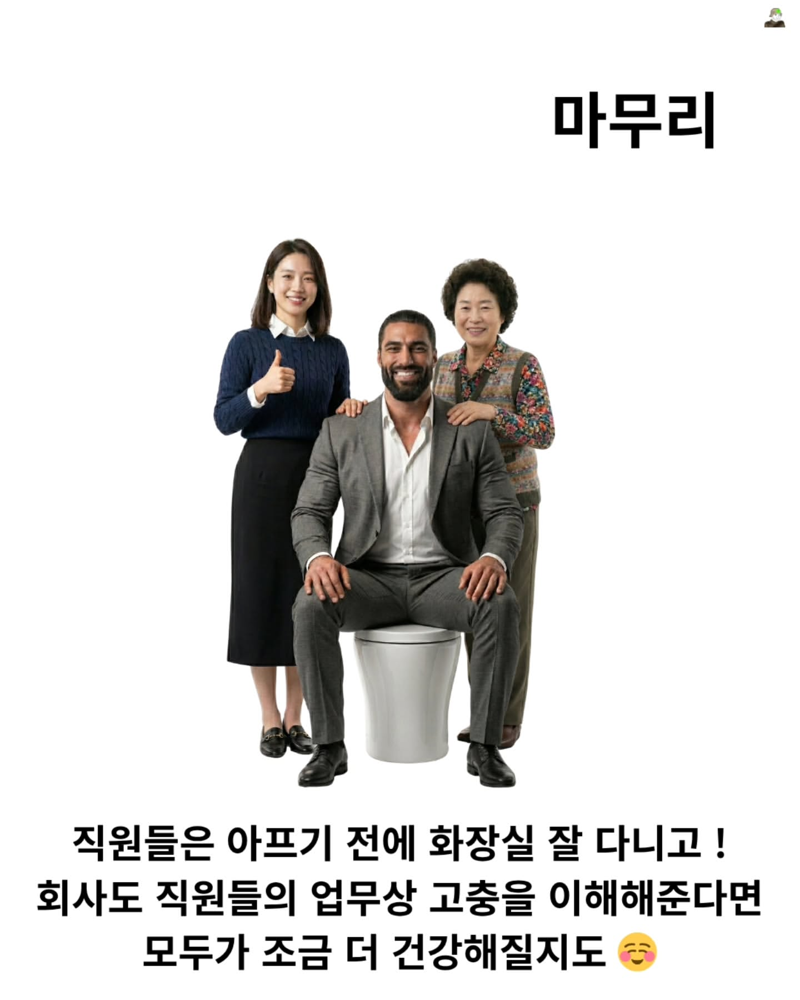

# ⬇️_크랜베리_:_순애

## 기본 정보

- **계정**: @kor.medicalmeme
- **게시일**: 2026-03-29
- **URL**: https://www.instagram.com/p/DWdadg2CYvk/
- **카드 수**: 10장
- **좋아요**: 381

## 캡션

```
⬇️ 크랜베리 : 순애는.. 종교다..!! ⬇️

대장균의 NTR로부터 방광을 지키기 위해 나타난 크랜베리 기사...!!

크랜베리의 방광염 예방 효과는 낮은 근거 수준일지라도 어느정도 입증되었지만, proanthocyanidins 성분의 용량이 중요한 요인으로 알려져있습니다. 한 메타분석에서는 하루 36mg 이상의 proanthocyanidins 성분을 12 - 24주 섭취하였을 때 효과가 있었다고 보고하였습니다.

하여튼, 크랜베리 주스도 좋지만, 화장실 제때 가서 예방하고, 만약 아프면 부끄러워도 비뇨기과나 산부인과를 찾아가서 올바른 처방을 받는 것이 중요할 것입니다.
```

## 카드별 이미지




















